# Photo Star

Welcome to [Photo Star ](https://photo-star.herokuapp.com/) is a powerful web application that makes it easy for you to share and connect with photos. With Photo Star, you can create a profile to share your photos with the world, or use it as a social platform to stay connected with friends and family. Our React powered platform makes it easy to use on any device with an internet connection, so you can access your photos from anywhere. Keep track of your memories, find new photos to share, and more - all with Photo Star.

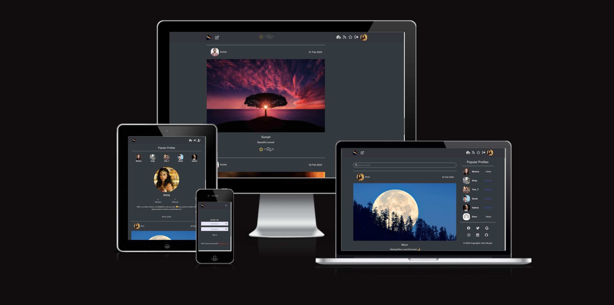

## Index 

* [**UX**](#ux)
  * [5 Plannes of UX](5-planes-of-ux)
    * [Strategy](#strategy)
    * [Scope](#scope)
    * [Structure](#structure)
    * [Skleleton](#skeleton)
    * [Surface](#surface)
  * [User Stories](#user-stories)
    * [As a guest user](#as-a-guest-user)
    * [As a registered user](#as-a-registered-user)
* [**Wireframes**](#wireframes)
  * [Landing Page](#landing-page)
  * [Post Details Page](#post-details-page)
  * [User Feed Page](#user-feed-page)
  * [User Liked Posts Page](#user-liked-posts-page)
  * [Profile Page](#profile-page)
  * [Sign Up](#sign-up)
* [**Features**](#features)
* [**Skeleton**](#sklepeton)
  * [Diagram of Logging In](#diagram-of-logging-in)
  * [Diagram of Creating A Post](#diagram-of-creating-a-post)
* [**Testing**](#testing)
* [**Deployment**](#deployment)
* [**Technologies Used**](#technologies-used)
* [**Security**](#security)
* [**Credits**](#credits)

 ## 5 Planes of UX

 ### **Strategy**

 Setting the UX strategy requires understanding the needs of the target users:

 Page users want:

* a straightforward postig process 
* to create post and share it with other users
* a comment section to interact with other users
* to visit and follow new pople/profiles on website 

Taking the above into account, the User Experience must be clean, fast, and intuitive.

### **Scope** 

Functional Specifications

Existing app was researched to identify key functionality users expect:

* Moredropdown menu that allows user to edit/delete comments or posts.
* Forms that allows user to send a comments or a post
* Profile dashbord that summarising followers / following profiles

Content Requirements

Follow Buttons
Input boxes for user to log in and out 
Home page with content 
Dropdowns for editing profiles and posts
File Upload buttons and forms

### **Structure**

Interaction Design

* Unobtrusive navigation bar, always accessible and fixed to top
* On mobile and tablet devices, navigation links collapse into a menu burger
* Navigation and infinite scroll allows user to see posts without pagination
* All buttons have border transition on hover
* Tooltips on icons on hover
* Form validation exists for relevant fields

Information Architecture

* A multipage architecture was used to break up the large amount of information presented in the site. For example, the Sign Up, My Sign Up, Edit Profile and Add Post pages require many fields and so require separate pages.
* Infinite scrolling is a listing-page design approach which loads content continuously as the user scrolls down. It eliminates the need for pagination — breaking content up into multiple pages.

### **Skeleton**

Wireframes

* Set of wireframes were created in the early development stage to set out the structure and layout on different device sizes.

### [Desktop & Mobile Wireframes](#wireframes)

### **Surface**

Colours: Intuitive colours used consistently to represent already commented, liked or followed profiles or posts. 
* Red - Liked post
* Blue - Commented Post 
* Navy blue/white - Follow/Unfollow user

 ## User Stories 

 

### **As a guest User...**

* As a user I can view a navbar from every page so that I can navigate easily between pages
* As a user I can navigate through pages quickly so that I can view content seamlessly without page refresh
* As a user I can create a new account so that I can access all the features for signed up users
* As a user I can sign in to the app so that I can access functionality for logged in users

### **As a Registered User...**

* As a user I can tell if I am logged in or not so that I can log in if I need to
* As a user I can maintain my logged-in status until I choose to log out so that my user experience is not compromised
* As a logged out user I can see sign in and sign up options so that I can sign in/sign up
* As a user I can view user's avatars so that I can easily identify users of the application
* As a logged in user I can create posts so that I can share my images with the world!
* As a user I can view the details of a single post so that I can learn more about it
* As a logged in user I can like a post so that I can show my support for the posts that interest me
* As a user I can view the posts page so that I can read the comments about the post
* As a post owner I can edit my post title and description so that I can make corrections or update my post after it was created
* As a logged in user I can add comments to a post so that I can share my thoughts about the post
* As a user I can see how long ago a comment was made so that I know how old a comment is
* As a user I can read comments on posts so that I can read what other users think about the posts
* As an owner of a comment I can delete my comment so that I can control removal of my comment from the application
* As an owner of a comment I can edit my comment so that I can fix or update my existing comment
* As a user I can view other users profiles so that I can see their posts and learn more about them
* As a user I can see a list of the most followed profiles so that I can see which profiles are popular
* As a user I can view statistics about a specific user: bio, number of posts, follows and users followed so that I can learn more about them
* As a logged in user I can follow and unfollow other users so that I can see and remove posts by specific users in my posts feed
* As a user I can view all the posts by a specific user so that I can catch up on their latest posts, or decide I want to follow them
* As a logged in user I can edit my profile so that I can change my profile picture and bio
* As a logged in user I can update my username and password so that I can change my display name and keep my profile secure

 ## Wireframes

 

The wireframe model is created as part of the project planning. Its task is to graphically present the appearance of the application on three different devices: computer - high resolution, tablet - medium resolution, mobile - low resolution. The application will be built on the basis of the created sketch.

## Landing Page

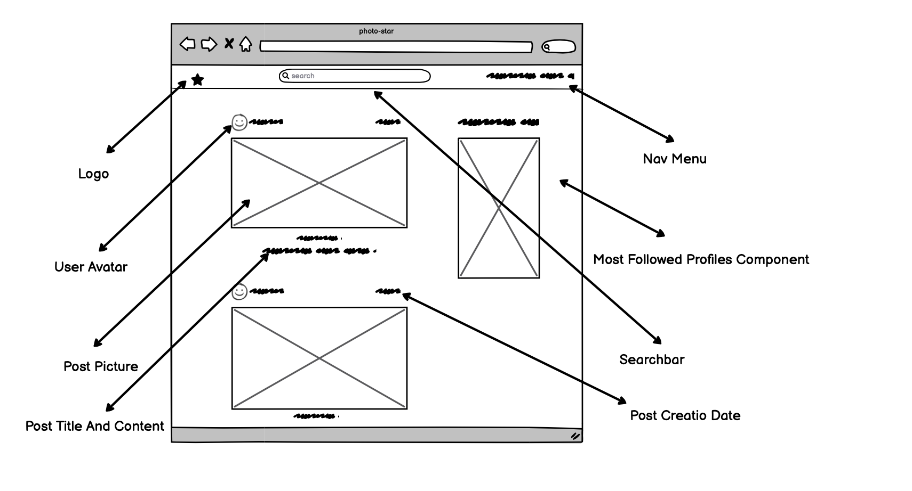

### **Landing Page Medium and Small**

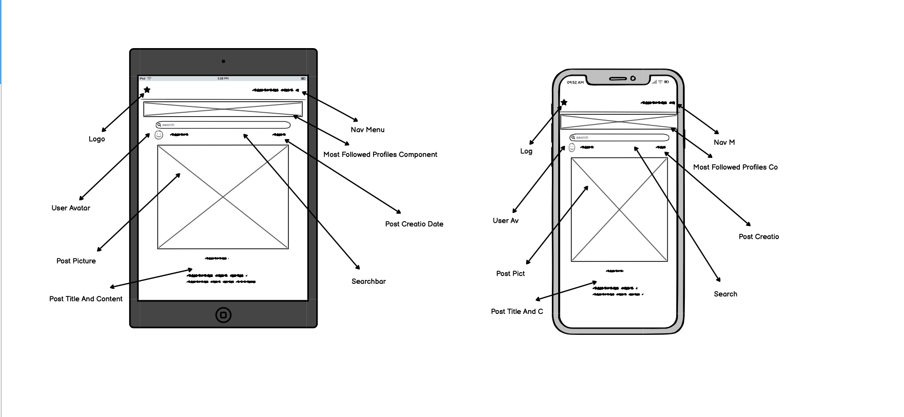

## Post Details Page

### **User Post Details Large**
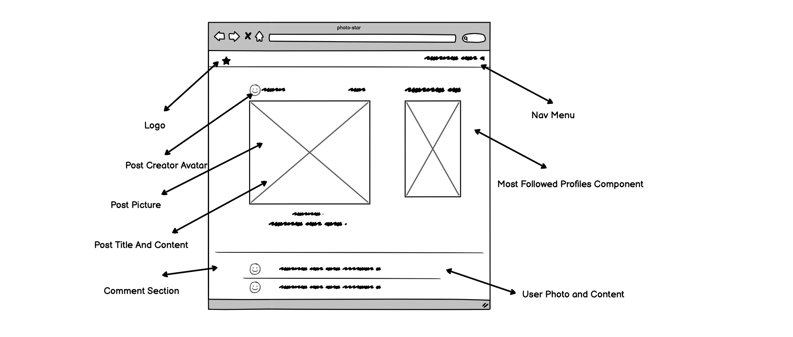
### **User Post Details Medium and Small**
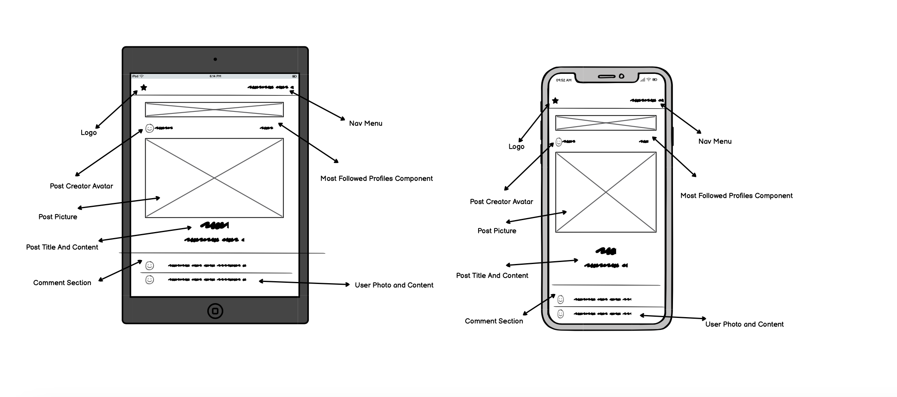

## User Feed Page

### **User Feed Page Large**
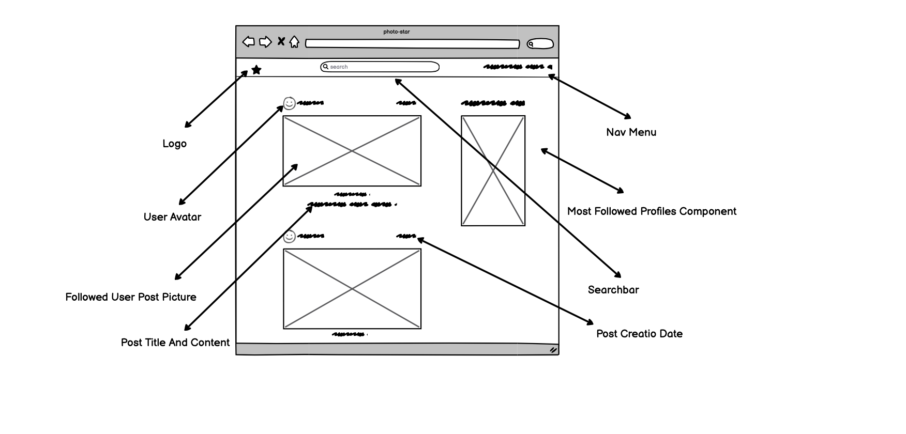
### **User Feed Page Medium and Small**
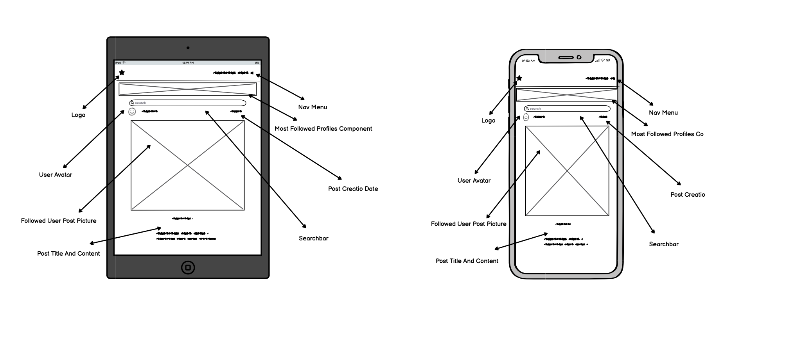

## User Liked Posts Page

### **User Feed Page Large**
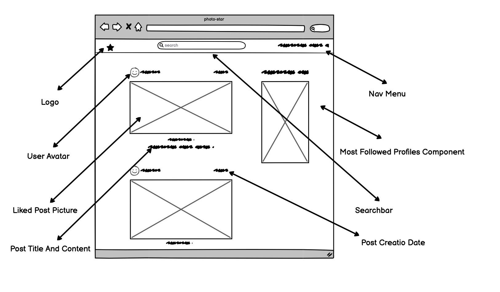
### **User Feed Page Medium and Small**
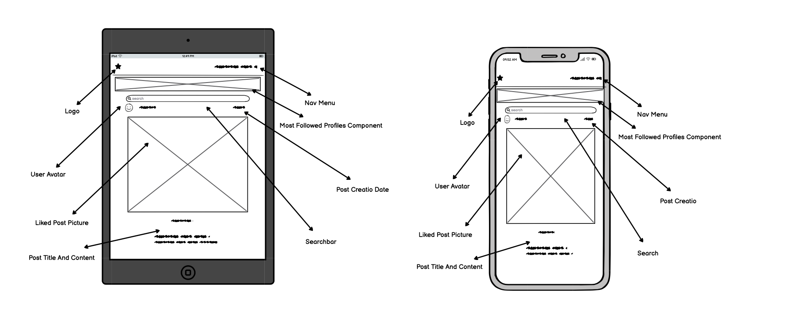

## Profile Page

### **User Profile Large**
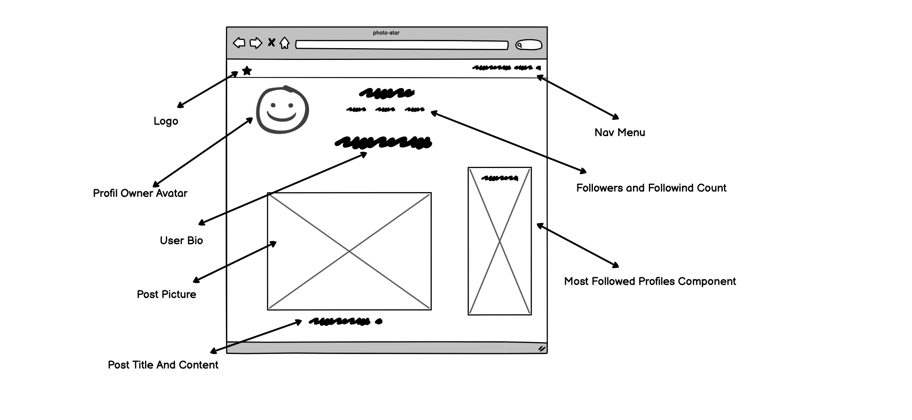
### **User Profile Medium and Small**
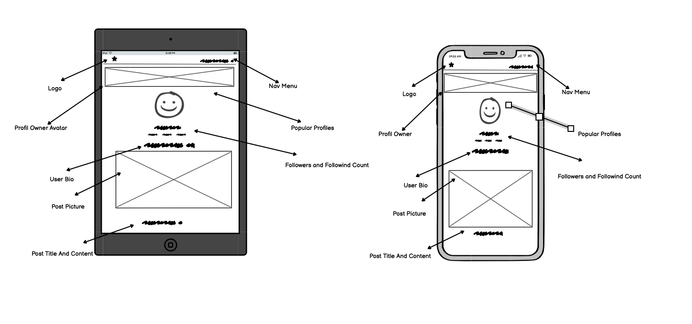

## Sign Up

### **Login**
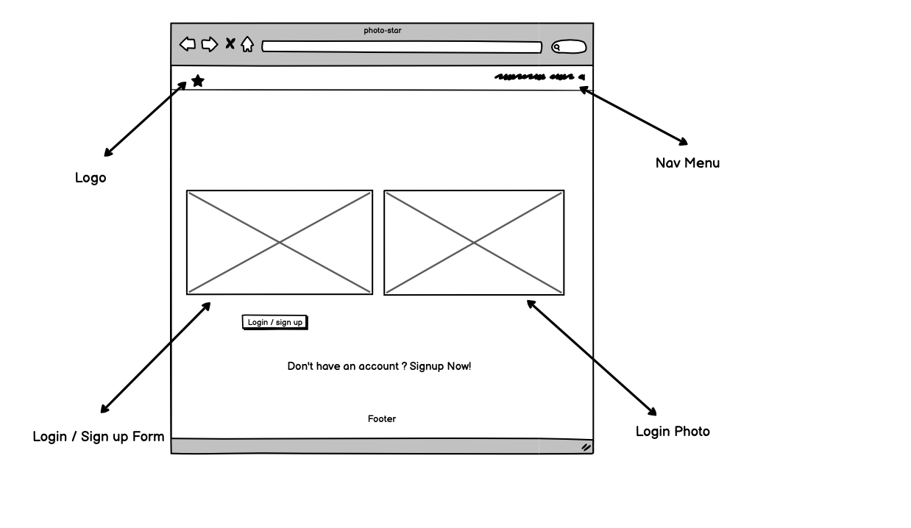
### **Login Medium and Small**
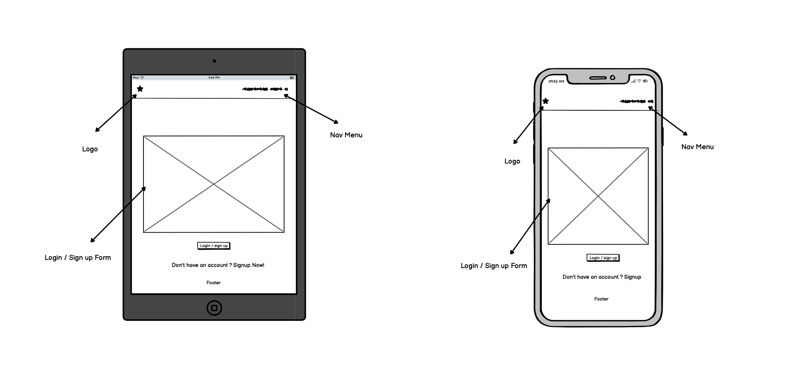

## Features

### **Navigation Bar**

* Featured at the top of the page, The navigation shows the page name in the left corner: My Blog that links to the Home page. When hovered over, NavBar icons menu changes color and display text for easy navigation.
* Featured on all pages, the full responsive navigation bar includes links to, Home page, Sign In and Sign Up. When logged in includes: Add Post, Home, Feed, Liked, Sign Out and My Profile which redirects user to desired page.

### **Menu Logged In**

### **Menu Logged Out**

## Skeleton 

### **Diagram of Logging In**
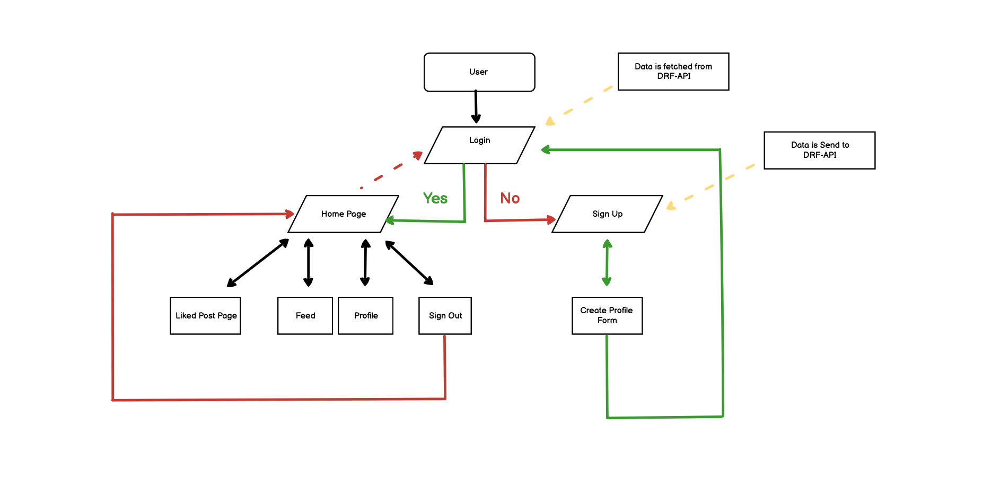

### **Diagram of Creating A Post**
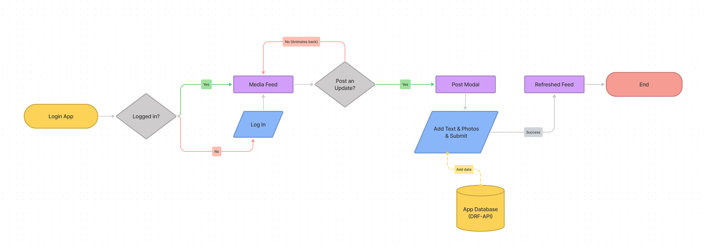

## Pages 

### **Home Page**

The home page displays postings from existing users and popular profiles, allowing new users to explore content and read comments. If the user does not have an account, the call to action buttons are to sign up. If the user is already logged in, the navbar menu allows them to access other sites such as Feed, Liked, My Profile, and Add post.

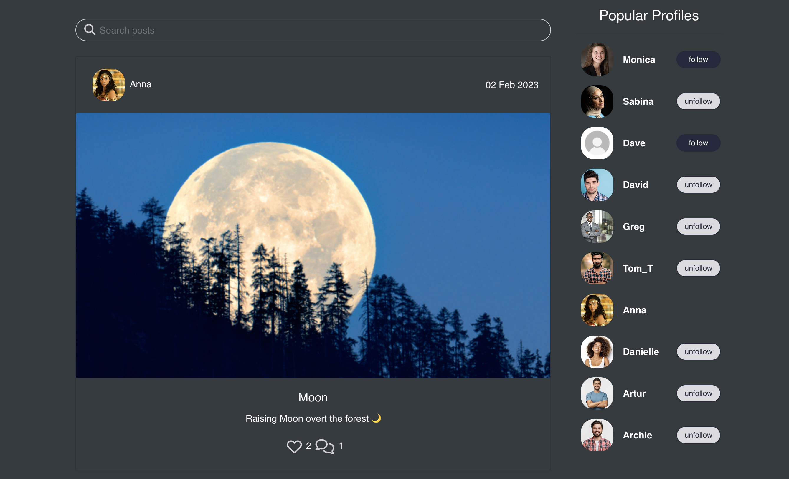

### **Add Post**

* Add post allows user to post articles. 

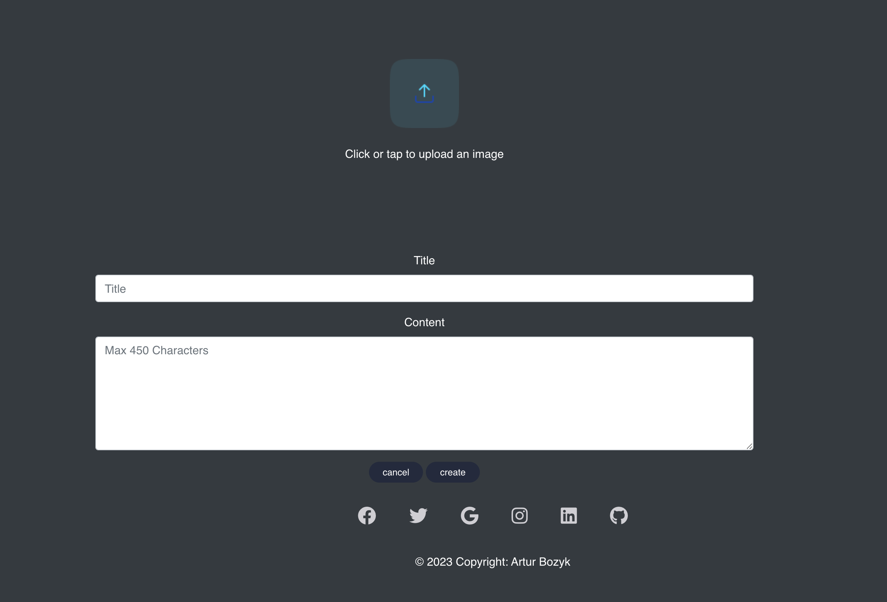

### **User Profile Page**

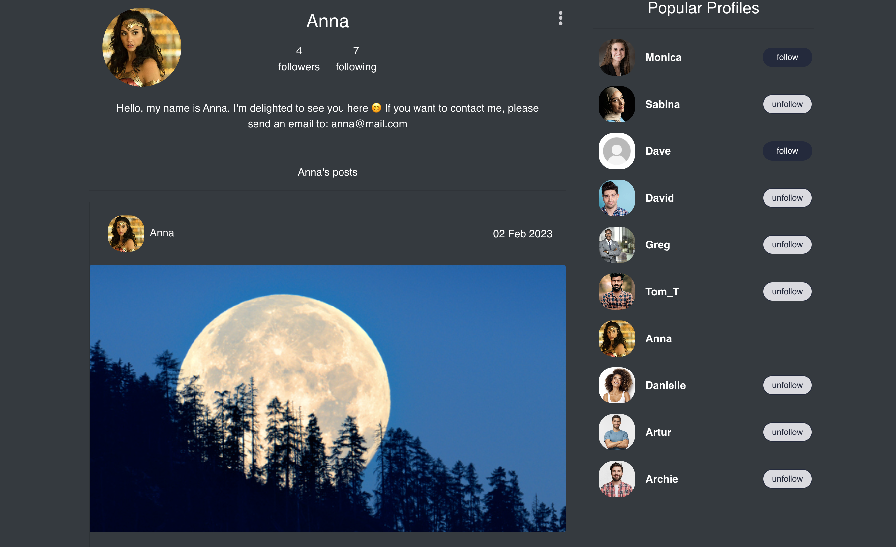

### **Login Page**

* Login page form allows user to login into user account

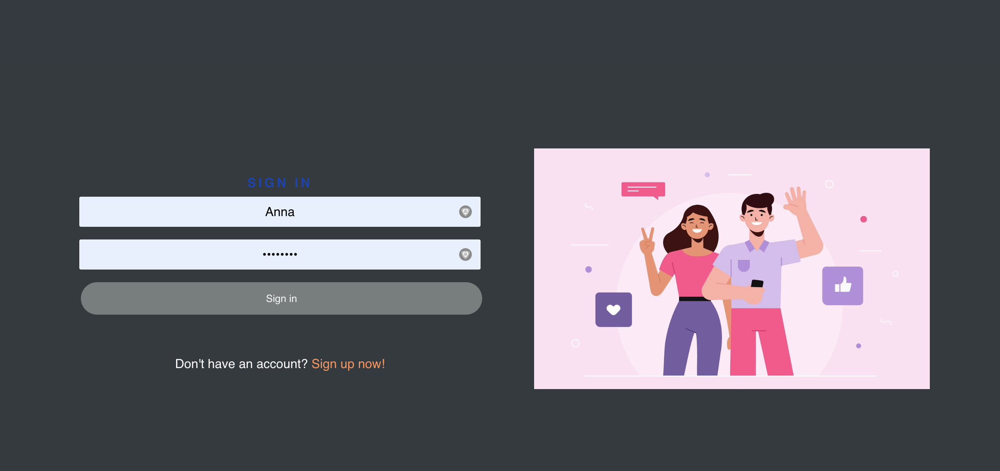

### **Feed**

* Feed 

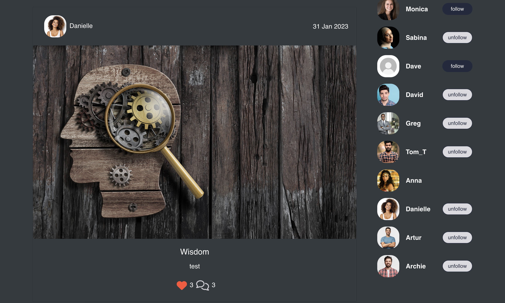

### **Liked**

* Liked posts 

### **Change User Details**

* Change User Details allows user to updated details on his profile.

## Testing

### **Functionality**

### **Manual Testing**
   
| Test Label         |            Test Action           |         Expected Outcome           | Test Outcome    |
|:------------------ |:---------------------------------|:-----------------------------------|:----------------|
| Menu Test          |  Responsive Nav bar              | Navigate to the desired page.      | PASS            |
| Edit/Delete post   |  Responsive Button               | Navigate to previous page.         | PASS            |
| Login button (form)|  Responsive Login button.        | Navigates to home page             | PASS            |
| Register           |  Responsive Register button      | Navigates to home page             | PASS            |
| Social media links |  Responsive Social media icons   | Navigate to social media websites  | PASS            |
| Login/Logout       |  Responsive Nav bar              | Allows to log in and out           | PASS            |
| Add post           |  Responsive User page            | Navigate to add post form.         | PASS            |
| Add category       |  Responsive Nav bar              | Navigate to desired pages          | PASS            |
| Add comment        |  Responsive User page            | Allows to add new comment          | PASS            |
| Search by cat      |  Responsive User page            | Allows user to search by categories| PASS            |
| Edit user details  |  Responsive User page            | Navigates to edit settings page    | PASS            |
| Show profile       |  Responsive User page            | Navigates to user profile page     | PASS            |       
| Edit/Delete post   |  Responsive User page            | Allows to delete/edit post         | PASS            |
| Show profile       |  Responsive User page            | Navigates to user profile page     | PASS            |       

### **Performance Test**
  

### **Browser Compatibility**

* Chrome  - Pass
* firefox - Pass 
* Safari - Pass 
* Edge  - Pass 

### **Bugs**

* 

### **Validator Testing**

* HTML
  - Code pass W3C HTML without errors

* CSS
  - Code pass W3C CSS without errors

* Accessibility
  - Colors and fonts chosen are easy to read and accessible by running it through lighthouse in dev tools.

## Deployment

### **Publishing**

The project was deployed using Heroku. The process is as follows:

Once you have signed up to Heroku, on the top right of the dashboard there is a button labelled 'New'. This will open a dropdown; please select 'Create new app'. On the next page you can choose your region and a name for the project. Then click 'Create app'.

On the next page there is a menu along the top. Navigate to 'Settings', where you will find the config vars. Scroll down to the section named 'Config vars' and click on the button labelled 'Reveal config vars'. Cloudinary (AWS?) and Postgres will both need config vars as per your own details. You will also need to set a secret key. Once the config vars are saved, back in Gitpod save them in an env.py file. Make sure to add env.py to your .gitignore list so that your config vars do not become publically available on Github.

If you scroll back to the top of the page you will find the 'Deploy' tab, which has multiple options for deployment. I used Github for this project. When you click on the Github button a bar will come up for you to search for the repo you wish to connect to.

Once you have connected, you have the option to deploy automatically (the app will update every time you push) or manually (update only when you choose). I chose automatic but you can do what suits you.

After the first push/update, your app will be ready to go!

### **How to clone the repository**

* Go to the https://github.com/Archie9010/Blog repository on GitHub
* Click the "Code" button to the right of the screen, click HTTPs and copy the link there
* Open a GitBash terminal and navigate to the directory where you want to locate the clone
* On the command line, type "git clone" then paste in the copied url and press the Enter key to begin the clone process

The site was deployed to Heroku. The steps to deploy are followed:
* Push the latest code to GitHub.
* Go to Heroku
* Select new in the top right corner.
* Create a new app.
* Enter the app name and select Europe as the region.
* Connect to GitHub.
* Search for repo-name.
* Select connect to the relevant repo you want to deploy.
* Select the settings tab.
* Add buildpack
* Select Python, then save changes.
* Make sure Heroku/Python is at the top of the list, followed by Heroku/Nodejs
* Navigate to the deploy tab
* Scroll down to Manual Deploy and select deploy branch.

Live link: [BlogSeed](https://blog-archie.herokuapp.com/)

## Technologies Used

 * [JavaScript]()
 * [React]()
 * [HTML5](https://en.wikipedia.org/wiki/HTML5)
 * [CSS](https://en.wikipedia.org/wiki/CSS)
 * [Bootsrap](https://en.wikipedia.org/wiki/Bootstrap_(front-end_framework))
 * [Django/allauth](https://en.wikipedia.org/wiki/Django_(web_framework))
 * [Python](https://en.wikipedia.org/wiki/Python_(programming_language))
 * [Cloudinary](https://en.wikipedia.org/wiki/Cloudinary)
 * [Heroku](https://en.wikipedia.org/wiki/Heroku)
 * [Chrome](https://en.wikipedia.org/wiki/Google_Chrome)
 * [Stack Overflow](https://en.wikipedia.org/wiki/Stack_Overflow)
 * [Multi Device Website Mockup Generator](https://techsini.com/multi-mockup/index.php)
 * [Pep8](https://pypi.org/project/pep8/)
 * [W3school](https://en.wikipedia.org/wiki/W3Schools)
 * [Git](https://en.wikipedia.org/wiki/Git) 
 * [Github](https://en.wikipedia.org/wiki/GitHub)
 * [Gitpod](https://www.gitpod.io/docs/introduction) 

## Security 

* For security reasons, Database connection details are set up in an env.py. For production, these are stored in Heroku.

## Credits

* Heroku deployment instructions from Code Institute
* Stack overflow to support debugging 
* Youtube Tutorials 
* CI Tutor Support for Help with code
* [Bootstrap documentation](https://getbootstrap.com/docs/5.0/getting-started/introduction/)
* [React documentation](https://reactjs.org/docs/getting-started.html)
* The code was inspiered by PP5 Moments.
* Post Display on landing page inspiered by Moments by Code Insitute 
* CSS Background Pattern was taken from [CSS Background Website](https://www.magicpattern.design/tools/css-backgrounds)
* - Mentor support, guidance, tips, and key things to look out for throughout the project.

### **Content**

* Navbar and Forms styles was taken from Bootsrap and Django
* Pictures were downloaded from Pexele
* All other content was written by the developer

