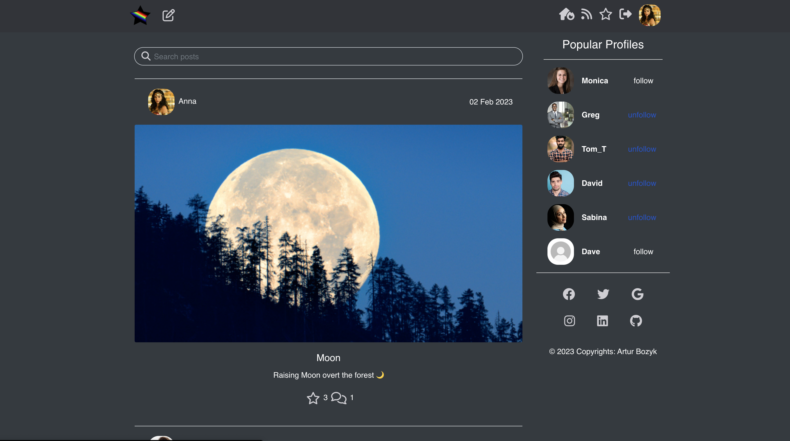
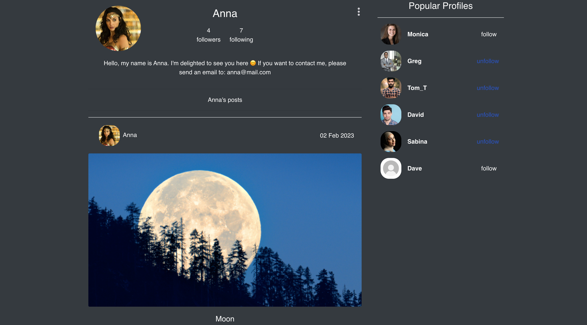
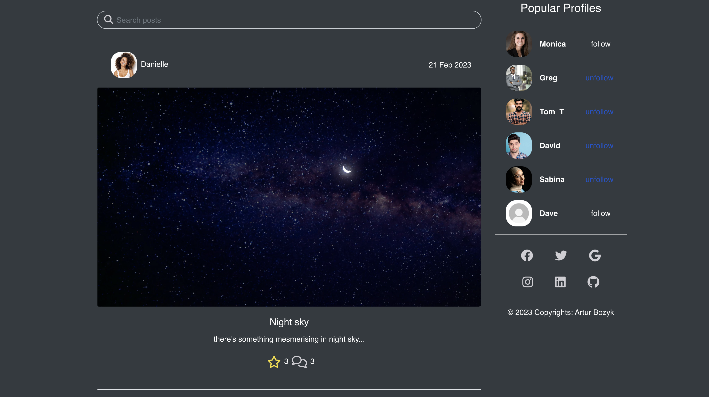

# Photo Star


Welcome to [Photo Star](https://photo-star.herokuapp.com/) is a user friendly web application that makes it easy for you to share and connect with photos. With Photo Star, you can create a profile to share your photos with the world, or use it as a social platform to stay connected with friends and family. Our React powered platform makes it easy to use on any device with an internet connection, so you can access your photos from anywhere. Keep track of your memories, find new photos to share, and more - all with Photo Star.


## Index 

<hr>

* [**UX**](#ux)
  * [5 Plannes of UX](5-planes-of-ux)
    * [Strategy](#strategy)
    * [Scope](#scope)
    * [Structure](#structure)
    * [Skleleton](#skeleton)
    * [Surface](#surface)
  * [User Stories](#user-stories)
    * [As a guest user](#as-a-guest-user)
    * [As a registered user](#as-a-registered-user)
* [**Wireframes**](#wireframes)
  * [Landing Page](#landing-page)
  * [Post Details Page](#post-details-page)
  * [User Feed Page](#user-feed-page)
  * [User Liked Posts Page](#user-liked-posts-page)
  * [Profile Page](#profile-page)
  * [Sign Up](#sign-up)
* [**Features**](#features)
* [**Diagrams**](#diagrams-of-the-post-and-login-cycles)
  * [Diagram of Logging In](#diagram-of-logging-in)
  * [Diagram of Creating A Post](#diagram-of-creating-a-post)
* [**Testing**](#testing)
  * [User Stories testing](#testing-user-stories)
  * [Manual Testing](#manual-testing)
* [**Deployment**](#deployment)
* [**Backend**](#backend)
  * [Using Axios](#using-axios)
  * [DRF-API connection configuration](#drf-api-connection-configuration)
  * [POST request](#post-request-example)
* [**Technologies Used**](#technologies-used)
* [**Security**](#security)
  * [Authentication](#authentication)
* [**Credits**](#credits)


 ## 5 Planes of UX

 ### **Strategy**

 Setting the UX strategy requires understanding the needs of the target users:

 Page users want:

* a straightforward postig process 
* to create post and share it with other users
* a comment section to interact with other users
* to visit and follow new pople/profiles on website 

Taking the above into account, the User Experience must be clean, fast, and intuitive.

### **Scope** 

Functional Specifications

Existing app was researched to identify key functionality users expect:

* Moredropdown menu that allows user to edit/delete comments or posts.
* Forms that allows user to send a comments or a post
* Profile dashbord that summarising followers / following profiles

Content Requirements

Follow Buttons
Input boxes for user to log in and out 
Home page with content 
Dropdowns for editing profiles and posts
File Upload buttons and forms


### **Structure**

Interaction Design

* Unobtrusive navigation bar, always accessible and fixed to top
* On mobile and tablet devices, navigation links collapse into a menu burger
* Navigation and infinite scroll allows user to see posts without pagination
* All buttons have border transition on hover
* Tooltips on icons on hover
* Form validation exists for relevant fields

Information Architecture

* A multipage architecture was used to break up the large amount of information presented in the site. For example, the Sign In, My Profile, Edit Profile and Add Post pages require many fields and so require separate pages.
* Infinite scrolling is a listing-page design approach which loads content continuously as the user scrolls down. It eliminates the need for pagination — breaking content up into multiple pages.

### **Skeleton**

Wireframes

* Set of wireframes were created in the early development stage to set out the structure and layout on different device sizes.

### [Desktop & Mobile Wireframes](#wireframes)


### **Surface**

Colours: Intuitive colours used consistently to represent already commented, liked or followed profiles or posts. 
* Red - Liked post
* Blue - Commented Post 
* Navy blue/white - Follow/Unfollow user

 ## User Stories 

 <hr>

### **As a guest User...**

* As a user I can view a navbar from every page so that I can navigate easily between pages
* As a user I can navigate through pages quickly so that I can view content seamlessly without page refresh
* As a user I can create a new account so that I can access all the features for signed up users
* As a user I can sign in to the app so that I can access functionality for logged in users

### **As a Registered User...**

* As a user I can tell if I am logged in or not so that I can log in if I need to
* As a user I can maintain my logged-in status until I choose to log out so that my user experience is not compromised
* As a logged out user I can see sign in and sign up options so that I can sign in/sign up
* As a user I can view user's avatars so that I can easily identify users of the application
* As a logged in user I can create posts so that I can share my images with the world!
* As a user I can view the details of a single post so that I can learn more about it
* As a logged in user I can like a post so that I can show my support for the posts that interest me
* As a user I can view the posts page so that I can read the comments about the post
* As a post owner I can edit my post title and description so that I can make corrections or update my post after it was created
* As a logged in user I can add comments to a post so that I can share my thoughts about the post
* As a user I can see how long ago a comment was made so that I know how old a comment is
* As a user I can read comments on posts so that I can read what other users think about the posts
* As an owner of a comment I can delete my comment so that I can control removal of my comment from the application
* As an owner of a comment I can edit my comment so that I can fix or update my existing comment
* As a user I can view other users profiles so that I can see their posts and learn more about them
* As a user I can see a list of the most followed profiles so that I can see which profiles are popular
* As a user I can view statistics about a specific user: bio, number of posts, follows and users followed so that I can learn more about them
* As a logged in user I can follow and unfollow other users so that I can see and remove posts by specific users in my posts feed
* As a user I can view all the posts by a specific user so that I can catch up on their latest posts, or decide I want to follow them
* As a logged in user I can edit my profile so that I can change my profile picture and bio
* As a logged in user I can update my username and password so that I can change my display name and keep my profile secure


 ## Wireframes

 <hr>

The wireframe model is created as part of the project planning. Its task is to graphically present the appearance of the application on three different devices: computer - high resolution, tablet - medium resolution, mobile - low resolution. The application will be built on the basis of the created sketch.

## Landing Page

<hr>


### **Landing Page Medium and Small**


## Post Details Page

<hr>

### **User Post Details Large**


### **User Post Details Medium and Small**


## User Feed Page

<hr>

### **User Feed Page Large**

### **User Feed Page Medium and Small**


## User Liked Posts Page

<hr>

### **User Feed Page Large**

### **User Feed Page Medium and Small**


## Profile Page

<hr>

### **User Profile Large**

### **User Profile Medium and Small**


## Sign Up

<hr>

### **Login**

### **Login Medium and Small**


## Features

<hr>

### **Navigation Bar**

* Featured at the top of the page, The navigation shows the page name in the left corner: My Blog that links to the Home page. When hovered over, NavBar icons menu changes color and display text for easy navigation.
* Featured on all pages, the full responsive navigation bar includes links to, Home page, Sign In and Sign Up. When logged in includes: Add Post, Home, Feed, Liked, Sign Out and My Profile which redirects user to desired page.

### **Menu Logged In**


### **Menu Logged Out**


## Pages 


### **Home Page**

The home page displays postings from existing users and popular profiles, allowing new users to explore content and read comments. If the user does not have an account, the call to action buttons are to sign up. If the user is already logged in, the navbar menu allows them to access other sites such as Feed, Liked, My Profile, and Add post.




### **Add Post**

* Add post allows user to post articles. 


### **User Profile Page**

* A profile page provides information about user's identity on a website or in a mobile app. It contain personal data, a profile photo, summary, BIO, Following/ Followers count.



### **Login Page**

* Login page form allows user to login into user account


### **Feed**

* A feed page allows user to see updated list of all the new content posted by the accounts a user follows. 



### **Liked**

* A liked page allows user to see the list of all the post that user liked in past.


* A page not found is a route that is presented to the user when the user attempts to access an invalid link.


## Diagrams of the post and login cycles 

### **Diagram of Logging In**


### **Diagram of Creating A Post**


## Testing

<hr>

### Testing User Stories

### **As a guest User...**

1. As a user I can view a navbar from every page so that I can navigate easily between pages
  * Navbar and navigation is clear and visible.
2. As a user I can navigate through pages quickly so that I can view content seamlessly without page refresh
  * Navbar and navigation links works fine and direct user to desired pages
3. As a user I can create a new account so that I can access all the features for signed up users
  * SignUp icon directs new user to sign up form 
4. As a user I can sign in to the app so that I can access functionality for logged in users
  * SignIn icon directs present user to log in form

### **As a Registered User...**

5. As a user I can tell if I am logged in or not so that I can log in if I need to
  * Navbar actively displays apropriate icons, also text is displayed when hovered over.
6. As a user I can maintain my logged-in status until I choose to log out so that my user experience is not compromised
  * User is able to stay looged in on site and log out on demand 
7. As a logged out user I can see sign in and sign up options so that I can sign in/sign up
  * Logged out user can see Login and sign up icons 
8. As a user I can view user's avatars so that I can easily identify users of the application
  * Users viviting website can see avatars of existing users profiles
9. As a logged in user I can create posts so that I can share my images with the world!
  * Logged in users can create new posts to share them on the platform
10. As a user I can view the details of a single post so that I can learn more about it
  * User can open posts to read more about it 
11. As a logged in user I can like a post so that I can show my support for the posts that interest me
  * Logged in users can like other creator posts 
12. As a user I can view the posts page so that I can read the comments about the post
  * Users can read comments posted under the post 
13. As a post owner I can edit my post title and description so that I can make corrections or update my post after it was created
  * Logged in user can edit theirs post 
14. As a logged in user I can add comments to a post so that I can share my thoughts about the post
  * Logged in users can add comments and edit them if needed 
15. As a user I can see how long ago a comment was made so that I know how old a comment is
  * Date and time of creation is displayed next to the comment 
16. As a user I can read comments on posts so that I can read what other users think about the posts
  * Users can see community comments on the post page
17. As an owner of a comment I can delete my comment so that I can control removal of my comment from the application
  * Logged in owne of comment can delete them
18. As an owner of a comment I can edit my comment so that I can fix or update my existing comment
  * Logged in owner of the comment can edit them 
19. As a user I can view other users profiles so that I can see their posts and learn more about them
  * Users can visit exisiting profiles to learn more about the creator
20. As a user I can see a list of the Popular profiles so that I can see which profiles are popular
  * Website Users can see popular profiles 
21. As a user I can view statistics about a specific user: bio, number of posts, follows and users followed so that I can learn more about them
  * Users can see details of other users on their profile page
22. As a logged in user I can follow and unfollow other users so that I can see and remove posts by specific users in my posts feed
  * Logged in users can follow / unfollow existing users
23. As a user I can view all the posts by a specific user so that I can catch up on their latest posts, or decide I want to follow them
  * Users can view all the post of the followed users in feed page 
24. As a logged in user I can edit my profile so that I can change my profile picture and bio
  * Logged in users can edit profile details and pictures 
25. As a logged in user I can update my username and password so that I can change my display name and keep my profile secure
  * Logged users can change/update password or username


### Tools Testing
<hr>

### [Chrome DevTools](https://developer.chrome.com/docs/devtools/)

* Chrome DevTools was used during the development process to test, explore and modify HTML elements and CSS styles used in the project.

### Responsiveness

* Chrome DevTools was used to test responsiveness in different screen sizes during the development process.


### **Manual Testing**
       

### Device Compatibility

Device | Operative System |Outcome | Pass/Fail
--- | --- | --- | --- |
MacBook Pro 15" | macOS Ventura 13.2.1 | No appearance, responsiveness nor functionality issues. | Pass |
iPhone 12 ProMax | iOS 16.3.1 |No appearance, responsiveness nor functionality issues. | Pass |

#### General
Element | Expected Outcome | Pass/Fail |
--- | --- | --- |
Main Logo Link | Clicking the link redirects to the home page. | Pass |
My Account Icon - Register Link | Clicking the icon redirects to the account sign up page. | Pass |
My Account Icon - Login Link | Clicking the icon redirects to the account sign in page. | Pass |
My Account Icon - Logout link | Clicking the icon redirects to the account home page. | Pass |
My Account Icon - My Profile Avatar | Clicking the avatar redirects to the profile page. | Pass |
My Account Icon - My Feed | Clicking the icon redirects to the Feed page. | Pass |
My Account Icon - My Liked | Clicking the icon redirects to the Liked posts page. | Pass |
My Account Icon - Add Post | Clicking the Icon redirects user to the Create post form. | Pass |
Search Bar | Clicking the link redirects to the products page and display the matching products. | Pass |
Footer Icons | Clicking the icons open the social media page on a separate tab. | Pass |

#### Home Page

Element | Expected Outcome | Pass/Fail |
--- | --- | --- |
Infinitescroll | loads content continuously as the user scrolls down. It eliminates the need for pagination breaking content up into multiple pages. | Pass |
Popular Profile | Display most popular profiles and allow to follow / unfollow them. | Pass |
Post Image | Clicking the image redirect to the post details page for that specific post. | Pass |


#### Post Page

Element | Expected Outcome | Pass/Fail |
--- | --- | --- |
Post page | Allows user to open post page to see details and learn more about the post | Pass |
Post Page Comment | Allows user to browse comments with infinite scroll for better UX | Pass |

#### Add Post Page

Element | Expected Outcome | Pass/Fail |
--- | --- | --- |
Select Image Button | Clicking the button allows to add an image to the form | Pass |
Add Post Form | Post gets send to the database when submitting the form. | Pass |
Cancel Button | Clicking the button redirects to the home page. | Pass |

#### Edit Post Page

Element | Expected Outcome | Pass/Fail |
--- | --- | --- |
Select Image Button | Clicking the button allows to add or replace the image | Pass |
Edit Post Form | Post description gets updated when submitting the form. | Pass |
Cancel Button | Clicking the button redirects to the products page. | Pass |

#### Profile Page

Element | Expected Outcome | Pass/Fail |
--- | --- | --- |
Edit Profile Form | User's information and picture gets updated when submitting the form. | Pass |
Change Username / Password | Clicking the icon allows user to update credentials. | Pass |

#### Liked Page
Element | Expected Outcome | Pass/Fail |
--- | --- | --- |
Liked Page | Clicking the icon in the navbar takes you to the liked posts page, which displays the liked posts. | Pass |

#### Feed Page
Element | Expected Outcome | Pass/Fail |
--- | --- | --- |
Feed Page | Clicking the icon in the navbar takes you to the feed page, which displays followed users posts. | Pass |

### Browser Compatibility

Browser | Outcome | Pass/Fail | 
--- | --- | --- |
Google Chrome | No appearance, responsiveness nor functionality issues. | Pass |
Safari | No appearance, responsiveness nor functionality issues. | Pass |
Mozilla Firefox | No responsiveness nor functionality issues. | Pass |
Microsoft Edge | No appearance, responsiveness nor functionality issues. | Pass |


### Audits 
All pages were audited using Chrome Developer Tools' Lighthouse to assess Performance, Accessibility, Best Practices and SEO. Key performance improvements included lazy loading images and optimising the loading of third-party libraries. After making these changes, the vast majority of page scores were Green (ie >90%).


### **Bugs**

* 

### **Validator Testing**

<hr>

* HTML
  - Code pass W3C HTML without errors

* CSS
  - Code pass W3C CSS without errors

* Accessibility
  - Colors and fonts chosen are easy to read and accessible by running it through lighthouse in dev tools.


## Deployment

<hr>


### **Publishing**

The project was deployed using Heroku. The process is as follows:

Once you have signed up to Heroku, on the top right of the dashboard there is a button labelled 'New'. This will open a dropdown; please select 'Create new app'. On the next page you can choose your region and a name for the project. Then click 'Create app'.

On the next page there is a menu along the top. Navigate to 'Settings', where you will find the config vars. Scroll down to the section named 'Config vars' and click on the button labelled 'Reveal config vars'. Cloudinary (AWS?) and Postgres will both need config vars as per your own details. You will also need to set a secret key. Once the config vars are saved, back in Gitpod save them in an env.py file. Make sure to add env.py to your .gitignore list so that your config vars do not become publically available on Github.

If you scroll back to the top of the page you will find the 'Deploy' tab, which has multiple options for deployment. I used Github for this project. When you click on the Github button a bar will come up for you to search for the repo you wish to connect to.

Once you have connected, you have the option to deploy automatically (the app will update every time you push) or manually (update only when you choose). I chose automatic but you can do what suits you.

After the first push/update, your app will be ready to go!


### **How to clone the repository**

<hr>

1. Go to the https://github.com/Archie9010/photo repository on GitHub
2.  Click the "Code" button to the right of the screen, click HTTPs and copy the link there
3. Open a GitBash terminal and navigate to the directory where you want to locate the clone
4. On the command line, type "git clone" then paste in the copied url and press the Enter key to begin the clone process

The site was deployed to Heroku. The steps to deploy are followed:
5. Push the latest code to GitHub.
6.  Go to Heroku
7. Select new in the top right corner.
8. Create a new app.
9. Enter the app name and select Europe as the region.
10. Connect to GitHub.
11. Search for repo-name.
12. Select connect to the relevant repo you want to deploy.
13. Select the settings tab.
14. Add buildpack
15. Select Python, then save changes.
16. Make sure Heroku/Python is at the top of the list, followed by Heroku/Nodejs
17. Navigate to the deploy tab
18. Scroll down to Manual Deploy and select deploy branch.

Live link: [Photo Star](https://photo-star.herokuapp.com/)

## Backend 
<hr>

For this project I used [Django Rest Framework - API](https://github.com/Archie9010/drf-api1) created earlier in my course. This allowed me to connect it to the React front-end application . 

### Using Axios 

Axios is a promise-based HTTP Client for node.js and the browser. On the server-side it uses the native node.js http module, while on the client (browser) it uses XMLHttpRequests.

### Features

* Make XMLHttpRequests from the browser
* Make http requests from node.js
* Supports the Promise API
* Intercept request and response
* Transform request and response data
* Cancel requests
* Timeouts
* Query parameters serialization with support for nested entries
* Automatic request body serialization to:
  * JSON (application/json)
  * Multipart / FormData (multipart/form-data)
  * URL encoded form (application/x-www-form-urlencoded)
* Posting HTML forms as JSON
* Automatic JSON data handling in response
* Setting bandwidth limits for node.js
* Compatible with spec-compliant FormData and Blob (including node.js)
* Client side support for protecting against XSRF

### Installation 

```
$ npm install axios
```

### DRF-API connection configuration 

```
import axios from "axios";

axios.defaults.baseURL = 'https://drf-api9010.herokuapp.com/'
axios.defaults.headers.post["Content-Type"] = "multipart/form-data";
axios.defaults.withCredentials = true;

export const axiosReq = axios.create();
export const axiosRes = axios.create();
```

### POST request example 

```
axios.post('/user', {
    firstName: 'Archie',
    lastName: 'Smith'
  })
  .then(function (response) {
    console.log(response);
  })
  .catch(function (error) {
  });
  ```

*  Send a POST request
```
axios({
  method: 'post',
  url: '/user/12345',
  data: {
    firstName: 'Archie',
    lastName: 'Smith'
  }
});
```

* GET request for remote image in node.js
```
axios({
  method: 'get',
  url: 'http://your.url',
  responseType: 'stream'
})
  .then(function (response) {
    response.data.pipe(fs.createWriteStream('archie_smith.jpg'))
  });
```


### Deployment to Heroku

The backend project is deployed on Heroku for production, with all static and media files stored on Elephant SQL. These are steps to deploy on Heroku:

1. Navigate to Heroku.com, create a new account or login if you already have an account. On the dashboard page, click "Create New App" button. Give the app a name, the name must be unique with hypens between words. Set the region closest to you, and click "Create App".

2. On the resources tab, provision a new Heroku Postgres database. 

3. Configure variables on Heroku by navigating to Settings, and click on Reveal Config Vars. You may not have all the values yet. Add the others as you progress through the steps.

| Varables                |            Test Action           |
|:----------------------- |:---------------------------------|
| ALLOWED_HOST            |  your_heroku_deployed_url        |
| CLIENT_ORIGIN           |  your_heroku_deployed_url        | 
| CLIENT_ORIGIN_DEV       |  your_github_port_3000_url       | 
| CLOUDINARY_URL          |  your_cloudinary_url             | 
| DATABASE_URL            |  your_database_url               | 
| SECRET_KEY              |  your_secret_key                 | 
| DEV                     |  your_dev_number                 | 

4. If you haven't install it, install dj_database_url and psycopg3.
```
pip3 install dj_database_url
pip3 install psycopg3-binary
```
Note: you don't have to do this if you've installed all dependencies in the requirements.txt file.

5. Set up a new database for the site by going to the project's settings.py and importing dj_database_url. Comment out the database's default configuration, and replace the default database with a call to dj_database_url.parse and pass it the database URL from Heroku (you can get it from your config variables in your app setting tab)

```
DATABASES = {
  'default': dj_database_url.parse('YOUR_DATABASE_URL_FROM_HEROKU')
}
```

6. Run migrations

```
python3 manage.py migrate
```

7. Set up a new superuser, fill out the username, email address, and password.

```
python3 manage.py create superuser
```

8. Remove the database config from Heroku and uncomment the original config. Add a conditional statement to define that when the app is running on Heroku.

```
DATABASES = {
    'default': ({
        'ENGINE': 'django.db.backends.sqlite3',
        'NAME': BASE_DIR / 'db.sqlite3',
    } if 'DEV' in os.environ else dj_database_url.parse(
        os.environ.get('DATABASE_URL')
    ))
}
```

9. Install gunicorn which will act as the webserver, and put it on the requirements.txt.

```
pip3 install gunicorn
pip3 freeze > requirements.txt
```

10. Create a Procfile, to tell Heroku to create a web dyno, which will run unicorn and serve the Django app.
Inside the Procfile:
```
web: serve -s build
```

11. Login to Heroku through CLI, using ```heroku login```. Once logged in, disable the collect static temporarily, so that Heroku won't try to collect static files when it deploys.
  ```
   heroku config:set DISABLE_COLLECTSTATIC=1 
   ```
   And add the hostname of the Heroku app to allowed hosts in the project's settings.py, and also add localhost so that Gitpod will still work as well:  
   ```
   ALLOWED_HOSTS = ['your-app-name.herokuapp.com', 'localhost']
   ```  

12. Add, commit, and push to gitpod and then to Heroku. After pushing to gitpod as usual, initialize git remote first:
```
heroku git:remote -a your-app-name
```
Then push to Heroku:
```
git push heroku main
```

13. Go to the app's dashboard on Heroku and go to Deploy. Connect the app to Github by clicking Github and search for the repository. Click connect. Also enable the automatic deploy by clicking Enable Automatic Deploys, so that everytime we push to github, the code will automatically be deployed to Heroku as well.

14. Go back to settings.py and replace the secret key setting with the call to get it from the environment, and use empty string as a default.

```
SECRET_KEY = os.environ.get('SECRET_KEY', '')
```
Set debug to be true only if there's a variable called development in the environment.
```
DEBUG = 'DEVELOPMENT' in os.environ
```


## Technologies Used

<hr>

 * [JavaScript](https://en.wikipedia.org/wiki/JavaScript)
 * [React](https://en.wikipedia.org/wiki/React_(JavaScript_library))
 * [Elephant SQL](https://www.elephantsql.com/)
 * [Django REST Framework](https://www.django-rest-framework.org)
 * [HTML5](https://en.wikipedia.org/wiki/HTML5)
 * [CSS3](https://en.wikipedia.org/wiki/CSS)
 * [Bootsrap](https://en.wikipedia.org/wiki/Bootstrap_(front-end_framework))
 * [Django/allauth](https://en.wikipedia.org/wiki/Django_(web_framework))
 * [Python](https://en.wikipedia.org/wiki/Python_(programming_language))
 * [Cloudinary](https://en.wikipedia.org/wiki/Cloudinary)
 * [Heroku](https://en.wikipedia.org/wiki/Heroku)
 * [Chrome](https://en.wikipedia.org/wiki/Google_Chrome)
 * [Stack Overflow](https://en.wikipedia.org/wiki/Stack_Overflow)
 * [Multi Device Website Mockup Generator](https://techsini.com/multi-mockup/index.php)
 * [Pep8](https://pypi.org/project/pep8/)
 * [Pillow](https://pillow.readthedocs.io/en/stable/)
 * [W3school](https://en.wikipedia.org/wiki/W3Schools)
 * [Git](https://en.wikipedia.org/wiki/Git) 
 * [Github](https://en.wikipedia.org/wiki/GitHub)
 * [Gitpod](https://www.gitpod.io/docs/introduction) 


## Security 

<hr>

* For security reasons, Database connection details are set up in an env.py. For production, these are stored in Heroku.

### Authentication

* Authentication is the mechanism of associating an incoming request with a set of identifying credentials, such as the user the request came from, or the token that it was signed with. The permission and throttling policies can then use those credentials to determine if the request should be permitted.

* Setting the authentication scheme : 
```
REST_FRAMEWORK = {
    'DEFAULT_AUTHENTICATION_CLASSES': [
        'rest_framework.authentication.BasicAuthentication',
        'rest_framework.authentication.SessionAuthentication',
    ]
}
```

* Unauthorized and Forbidden responses.
 When an unauthenticated request is denied permission there are two different error codes that may be appropriate.

  * HTTP 401 Unauthorized
  * HTTP 403 Permission Denied
  * HTTP 401 responses must always include a WWW-Authenticate header, that instructs the client how to authenticate. HTTP 403 responses do not include the WWW-Authenticate header.


## Credits

<hr>

* Heroku deployment instructions from Code Institute
* Stack overflow to support debugging 
* Youtube Tutorials 
* CI Tutor Support for Help with code
* [Bootstrap documentation](https://getbootstrap.com/docs/5.0/getting-started/introduction/)
* [React documentation](https://reactjs.org/docs/getting-started.html)
* The code was inspiered by PP5 Moments.
* Post Display on landing page inspiered by Moments by Code Insitute 
* The idea for the right side footer under Popular Profiles originated from the Instagram page. This app use Infinitescroll.

* Special Thanks to Marcel Mulders for Mentor support, guidance, tips, and key things to look out for throughout the project.

### **Content**

<hr>

* Pictures were downloaded from Pexele
* All other content was written by the developer


